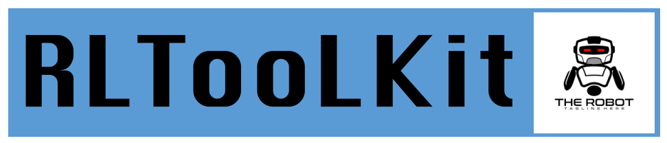
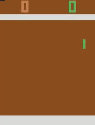
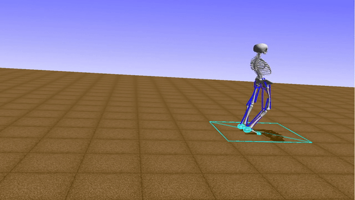
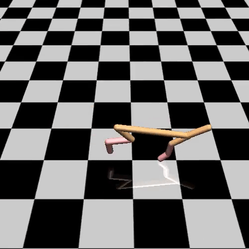
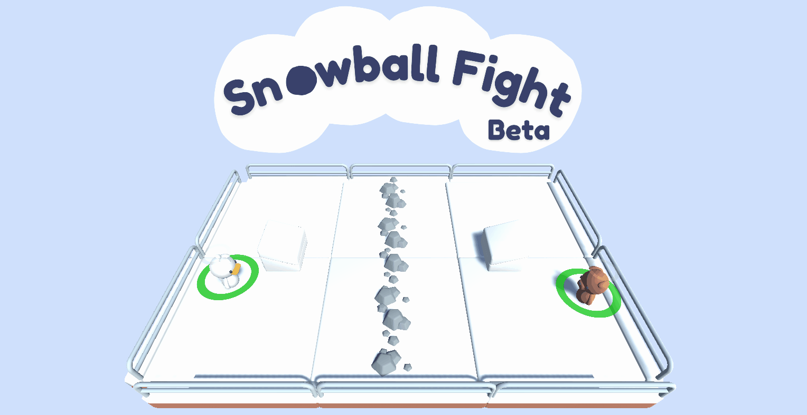

<!--

 * @Author: jianzhnie
 * @LastEditors: jianzhnie
 * @Description: RLToolKit is a flexible and high-efficient reinforcement learning framework.
 * Copyright (c) 2022 by jianzhnie@126.com, All Rights Reserved.
-->

<p align="center">

</p>

## Overview

RLToolkit is a flexible and high-efficient reinforcement learning framework. RLToolkit ([website](https://github.com/jianzhnie/deep-rl-toolkit))) is developed for practitioners with the following advantages:

- **Reproducible**. We provide algorithms that stably reproduce the result of many influential reinforcement learning algorithms.

- **Extensible**. Build new algorithms quickly by inheriting the abstract class in the framework.

- **Reusable**.  Algorithms provided in the repository could be directly adapted to a new task by defining a forward network and training mechanism will be built automatically.

- **Elastic**: allows to elastically and automatically allocate computing resources on the cloud.

- **Lightweight**: the core codes <1,000 lines (check [Demo](./examples/tutorials/lesson3/DQN/train.py)).

- **Stable**: much more stable than [Stable Baselines 3](https://github.com/DLR-RM/stable-baselines3) by utilizing various ensemble methods.


## Table of Content
- [Overview](#overview)
- [Table of Content](#table-of-content)
- [Abstractions](#abstractions)
  - [Model](#model)
  - [Algorithm](#algorithm)
  - [Agent](#agent)
- [Supported Algorithms](#supported-algorithms)
  - [Value Optimization Agents](#value-optimization-agents)
  - [Policy Optimization Agents](#policy-optimization-agents)
  - [General Agents](#general-agents)
  - [Imitation Learning Agents](#imitation-learning-agents)
  - [Hierarchical Reinforcement Learning Agents](#hierarchical-reinforcement-learning-agents)
  - [Memory Types](#memory-types)
  - [Exploration Techniques](#exploration-techniques)
- [Supported Envs](#supported-envs)
- [Examples](#examples)
- [Experimental Demos](#experimental-demos)
- [Contributions](#contributions)
- [References](#references)
- [Citation](#citation)


## Abstractions

<p align="center">

</p>

RLToolkit aims to build an agent for training algorithms to perform complex tasks.
The main abstractions introduced by PARL that are used to build an agent recursively are the following:

### Model
`Model` is abstracted to construct the forward network which defines a policy network or critic network given state as input.

### Algorithm
`Algorithm` describes the mechanism to update parameters in `Model` and often contains at least one model.

### Agent
`Agent`, a data bridge between the environment and the algorithm, is responsible for data I/O with the outside environment and describes data preprocessing before feeding data into the training process.

## Supported Algorithms

RLToolkit implements the following model-free deep reinforcement learning (DRL) algorithms:


A non-exhaustive, but useful taxonomy of algorithms in modern RL.


### Value Optimization Agents

* [Deep Q Network (DQN)](https://www.cs.toronto.edu/~vmnih/docs/dqn.pdf)  ([code]())
* [Double Deep Q Network (DDQN)](https://arxiv.org/pdf/1509.06461.pdf)  ([code]())
* [Dueling Q Network](https://arxiv.org/abs/1511.06581) ([code]())
* [Mixed Monte Carlo (MMC)](https://arxiv.org/abs/1703.01310)  ([code]())
* [Persistent Advantage Learning (PAL)](https://arxiv.org/abs/1512.04860)  ([code]())
* [Categorical Deep Q Network (C51)](https://arxiv.org/abs/1707.06887)  ([code]())
* [Quantile Regression Deep Q Network (QR-DQN)](https://arxiv.org/pdf/1710.10044v1.pdf)  ([code]())
* [N-Step Q Learning](https://arxiv.org/abs/1602.01783)  ([code]())
* [Neural Episodic Control (NEC)](https://arxiv.org/abs/1703.01988)  ([code]())
* [Normalized Advantage Functions (NAF)](https://arxiv.org/abs/1603.00748.pdf)  ([code]())
* [Rainbow](https://arxiv.org/abs/1710.02298)  ([code]())

### Policy Optimization Agents
* [Policy Gradients (PG)](http://www-anw.cs.umass.edu/~barto/courses/cs687/williams92simple.pdf)  ([code]())
* [Asynchronous Advantage Actor-Critic (A3C)](https://arxiv.org/abs/1602.01783)  ([code]())
* [Deep Deterministic Policy Gradients (DDPG)](https://arxiv.org/abs/1509.02971)  ([code]())
* [Proximal Policy Optimization (PPO)](https://arxiv.org/pdf/1707.06347.pdf)  ([code]())
* [Clipped Proximal Policy Optimization (CPPO)](https://arxiv.org/pdf/1707.06347.pdf)  ([code]())
* [Generalized Advantage Estimation (GAE)](https://arxiv.org/abs/1506.02438) ([code]())
* [Sample Efficient Actor-Critic with Experience Replay (ACER)](https://arxiv.org/abs/1611.01224)  ([code]())
* [Soft Actor-Critic (SAC)](https://arxiv.org/abs/1801.01290) ([code]())
* [Twin Delayed Deep Deterministic Policy Gradient (TD3)](https://arxiv.org/pdf/1802.09477.pdf) ([code]())

### General Agents

* [Direct Future Prediction (DFP)](https://arxiv.org/abs/1611.01779)  ([code]())

### Imitation Learning Agents
* Behavioral Cloning (BC)  ([code]())
* [Conditional Imitation Learning](https://arxiv.org/abs/1710.02410) ([code]())
### Hierarchical Reinforcement Learning Agents
* [Hierarchical Actor Critic (HAC)](https://arxiv.org/abs/1712.00948.pdf) ([code]())

### Memory Types
* [Hindsight Experience Replay (HER)](https://arxiv.org/abs/1707.01495.pdf) ([code]())
* [Prioritized Experience Replay (PER)](https://arxiv.org/abs/1511.05952) ([code]())

### Exploration Techniques
* E-Greedy ([code]())
* Boltzmann ([code]())
* Ornstein–Uhlenbeck process ([code]())
* Normal Noise ([code]())
* Truncated Normal Noise ([code]())
* [Bootstrapped Deep Q Network](https://arxiv.org/abs/1602.04621)  ([code]())
* [UCB Exploration via Q-Ensembles (UCB)](https://arxiv.org/abs/1706.01502) ([code]())
* [Noisy Networks for Exploration](https://arxiv.org/abs/1706.10295) ([code]())

##  Supported Envs

- **OpenAI Gym**
- **Atari**
- **MuJoCo**
- **PyBullet**

For the details of DRL algorithms, please check out the educational webpage [OpenAI Spinning Up](https://spinningup.openai.com/en/latest/).

## Examples

[//]: # (Image References)
<p align="center">

</p>
<p align="center">
  
<br>
<p align="center">
  
<br>

- [QuickStart](./benchmark/quickstart/train.py)
- [DQN](./benchmark/dqn/train.py)
- [DDPG](./benchmark/ddpg/train.py)
- [A2C](./benchmark/a2c/train.py)
- [TD3](./benchmark/a2c/train.py)
- [SAC](./benchmark/sac/train.py)
- [PPO](./benchmark/ppo/train.py)
- [QMIX](./benchmark/qmix/train.py)
- [MADDPG](./benchmark/mappo/train.py)
- [MAPPO](./benchmark/mappo/train.py)


## Experimental Demos

- **Quick start**
```python
# into demo dirs
cd  benchmark/quickstart/
# train
python train.py
```

**DNQ for CartPole-v0**
```python
# into demo dirs
cd  examples/tutorials/lesson3/DQN/
# train
python train.py
```
**DDPG for Pendulum-v1**

```python
# into demo dirs
cd  examples/tutorials/lesson5/ddpg/
# train
python train.py
```
...


## Contributions

We welcome any contributions to the codebase, but we ask that you please **do not** submit/push code that breaks the tests. Also, please shy away from modifying the tests just to get your proposed changes to pass them. As it stands, the tests on their own are quite minimal (instantiating environments, training agents for one step, etc.), so if they're breaking, it's almost certainly a problem with your code and not with the tests.

We're actively working on refactoring and trying to make the codebase cleaner and more performant as a whole. If you'd like to help us clean up some code, we'd strongly encourage you to also watch [Uncle Bob's clean coding lessons](https://www.youtube.com/playlist?list=PLmmYSbUCWJ4x1GO839azG_BBw8rkh-zOj) if you haven't already.

## References

1. Deep Q-Network (DQN) <sub><sup> ([V. Mnih et al. 2015](https://storage.googleapis.com/deepmind-media/dqn/DQNNaturePaper.pdf)) </sup></sub>
2. Double DQN (DDQN) <sub><sup> ([H. Van Hasselt et al. 2015](https://arxiv.org/abs/1509.06461)) </sup></sub>
3. Advantage Actor Critic (A2C)
4. Vanilla Policy Gradient (VPG)
5. Natural Policy Gradient (NPG) <sub><sup> ([S. Kakade et al. 2002](http://papers.nips.cc/paper/2073-a-natural-policy-gradient.pdf)) </sup></sub>
6. Trust Region Policy Optimization (TRPO) <sub><sup> ([J. Schulman et al. 2015](https://arxiv.org/abs/1502.05477)) </sup></sub>
7. Proximal Policy Optimization (PPO) <sub><sup> ([J. Schulman et al. 2017](https://arxiv.org/abs/1707.06347)) </sup></sub>
8. Deep Deterministic Policy Gradient (DDPG) <sub><sup> ([T. Lillicrap et al. 2015](https://arxiv.org/abs/1509.02971)) </sup></sub>
9. Twin Delayed DDPG (TD3) <sub><sup> ([S. Fujimoto et al. 2018](https://arxiv.org/abs/1802.09477)) </sup></sub>
10. Soft Actor-Critic (SAC) <sub><sup> ([T. Haarnoja et al. 2018](https://arxiv.org/abs/1801.01290)) </sup></sub>
11. SAC with automatic entropy adjustment (SAC-AEA) <sub><sup> ([T. Haarnoja et al. 2018](https://arxiv.org/abs/1812.05905)) </sup></sub>


| Policy Optimization | Algorithms                                    | Paper                                                        | Link |
| ------------------- | --------------------------------------------- | ------------------------------------------------------------ | ---- |
| Policy Optimization | [A2C / A3C](https://arxiv.org/abs/1602.01783) | (Asynchronous Advantage Actor-Critic): Mnih et al, 2016      |      |
| Policy Optimization | [PPO](https://arxiv.org/abs/1707.06347)       | (Proximal Policy Optimization): Schulman et al, 2017         |      |
| Policy Optimization |                                               | [TRPO](https://arxiv.org/abs/1502.05477) (Trust Region Policy Optimization): Schulman et al, 2015 |      |
| Policy Optimization |                                               |                                                              |      |
|                     |                                               |                                                              |      |
|                     |                                               |                                                              |      |
|                     |                                               |                                                              |      |
| Q-Learning          | DQN                                           | [DQN](https://www.cs.toronto.edu/~vmnih/docs/dqn.pdf) (Deep Q-Networks): Mnih et al, 2013 |      |
| Q-Learning          | QR-DQN                                        | [QR-DQN](https://arxiv.org/abs/1710.10044) (Quantile Regression DQN): Dabney et al, 2017 |      |
| Q-Learning          | C51                                           | [C51](https://arxiv.org/abs/1707.06887) (Categorical 51-Atom DQN): Bellemare et al, 2017 |      |
| Q-Learning          | HER                                           | [HER](https://arxiv.org/abs/1707.01495) (Hindsight Experience Replay): Andrychowicz et al, 2017 |      |
| Q-Learning          |                                               |                                                              |      |
| Po & Q-Learning     |                                               | [DDPG](https://arxiv.org/abs/1509.02971) (Deep Deterministic Policy Gradient): Lillicrap et al, 2015 |      |
| Po & Q-Learning     |                                               | [TD3](https://arxiv.org/abs/1802.09477) (Twin Delayed DDPG): Fujimoto et al, 2018 |      |
| Po & Q-Learning     |                                               | [SAC](https://arxiv.org/abs/1801.01290) (Soft Actor-Critic): Haarnoja et al, 2018 |      |
| Po & Q-Learning     |                                               |                                                              |      |
|                     |                                               |                                                              |      |
|                     |                                               |                                                              |      |
|                     |                                               |                                                              |      |
|                     |                                               |                                                              |      |

---

[1] jeremykun.com [Markov Chain Monte Carlo Without all the Bullshit](https://jeremykun.com/2015/04/06/markov-chain-monte-carlo-without-all-the-bullshit/)

[2] Richard S. Sutton and Andrew G. Barto. [Reinforcement Learning: An Introduction; 2nd Edition](http://incompleteideas.net/book/bookdraft2017nov5.pdf). 2017.

[3] John Schulman, et al. [“High-dimensional continuous control using generalized advantage estimation."](https://arxiv.org/pdf/1506.02438.pdf) ICLR 2016.

[4] Thomas Degris, Martha White, and Richard S. Sutton. [“Off-policy actor-critic."](https://arxiv.org/pdf/1205.4839.pdf) ICML 2012.

[5] timvieira.github.io [Importance sampling](http://timvieira.github.io/blog/post/2014/12/21/importance-sampling/)

[6] Mnih, Volodymyr, et al. [“Asynchronous methods for deep reinforcement learning."](https://arxiv.org/abs/1602.01783) ICML. 2016.

[7] David Silver, et al. [“Deterministic policy gradient algorithms."](https://hal.inria.fr/file/index/docid/938992/filename/dpg-icml2014.pdf) ICML. 2014.

[8] Timothy P. Lillicrap, et al. [“Continuous control with deep reinforcement learning."](https://arxiv.org/pdf/1509.02971.pdf) arXiv preprint arXiv:1509.02971 (2015).

[9] Ryan Lowe, et al. [“Multi-agent actor-critic for mixed cooperative-competitive environments."](https://arxiv.org/pdf/1706.02275.pdf) NIPS. 2017.

[10] John Schulman, et al. [“Trust region policy optimization."](https://arxiv.org/pdf/1502.05477.pdf) ICML. 2015.

[11] Ziyu Wang, et al. [“Sample efficient actor-critic with experience replay."](https://arxiv.org/pdf/1611.01224.pdf) ICLR 2017.

[12] Rémi Munos, Tom Stepleton, Anna Harutyunyan, and Marc Bellemare. [“Safe and efficient off-policy reinforcement learning”](http://papers.nips.cc/paper/6538-safe-and-efficient-off-policy-reinforcement-learning.pdf) NIPS. 2016.

[13] Yuhuai Wu, et al. [“Scalable trust-region method for deep reinforcement learning using Kronecker-factored approximation."](https://arxiv.org/pdf/1708.05144.pdf) NIPS. 2017.

[14] kvfrans.com [A intuitive explanation of natural gradient descent](http://kvfrans.com/a-intuitive-explanation-of-natural-gradient-descent/)

[15] Sham Kakade. [“A Natural Policy Gradient."](https://papers.nips.cc/paper/2073-a-natural-policy-gradient.pdf). NIPS. 2002.

[16] [“Going Deeper Into Reinforcement Learning: Fundamentals of Policy Gradients."](https://danieltakeshi.github.io/2017/03/28/going-deeper-into-reinforcement-learning-fundamentals-of-policy-gradients/) - Seita’s Place, Mar 2017.

[17] [“Notes on the Generalized Advantage Estimation Paper."](https://danieltakeshi.github.io/2017/04/02/notes-on-the-generalized-advantage-estimation-paper/) - Seita’s Place, Apr, 2017.

[18] Gabriel Barth-Maron, et al. [“Distributed Distributional Deterministic Policy Gradients."](https://arxiv.org/pdf/1804.08617.pdf) ICLR 2018 poster.

[19] Tuomas Haarnoja, Aurick Zhou, Pieter Abbeel, and Sergey Levine. [“Soft Actor-Critic: Off-Policy Maximum Entropy Deep Reinforcement Learning with a Stochastic Actor."](https://arxiv.org/pdf/1801.01290.pdf) arXiv preprint arXiv:1801.01290 (2018).

[20] Scott Fujimoto, Herke van Hoof, and Dave Meger. [“Addressing Function Approximation Error in Actor-Critic Methods."](https://arxiv.org/abs/1802.09477) arXiv preprint arXiv:1802.09477 (2018).

[21] Tuomas Haarnoja, et al. [“Soft Actor-Critic Algorithms and Applications."](https://arxiv.org/abs/1812.05905) arXiv preprint arXiv:1812.05905 (2018).

[22] David Knowles. [“Lagrangian Duality for Dummies”](https://cs.stanford.edu/people/davidknowles/lagrangian_duality.pdf) Nov 13, 2010.

[23] Yang Liu, et al. [“Stein variational policy gradient."](https://arxiv.org/abs/1704.02399) arXiv preprint arXiv:1704.02399 (2017).

[24] Qiang Liu and Dilin Wang. [“Stein variational gradient descent: A general purpose bayesian inference algorithm."](https://papers.nips.cc/paper/6338-stein-variational-gradient-descent-a-general-purpose-bayesian-inference-algorithm.pdf) NIPS. 2016.

[25] Lasse Espeholt, et al. [“IMPALA: Scalable Distributed Deep-RL with Importance Weighted Actor-Learner Architectures”](https://arxiv.org/abs/1802.01561) arXiv preprint 1802.01561 (2018).

[26] Karl Cobbe, et al. [“Phasic Policy Gradient."](https://arxiv.org/abs/2009.04416) arXiv preprint arXiv:2009.04416 (2020).

[27] Chloe Ching-Yun Hsu, et al. [“Revisiting Design Choices in Proximal Policy Optimization."](https://arxiv.org/abs/2009.10897) arXiv preprint arXiv:2009.10897 (2020).

## Citation

To cite this repository:

```
@misc{erl,
  author = {jianzhnie},
  title = {{RLToolkit}: An Easy  Deep Reinforcement Learning Toolkit},
  year = {2022},
  publisher = {GitHub},
  journal = {GitHub repository},
  howpublished = {\url{https://github.com/jianzhnie/deep-rl-toolkit}},
}
```
