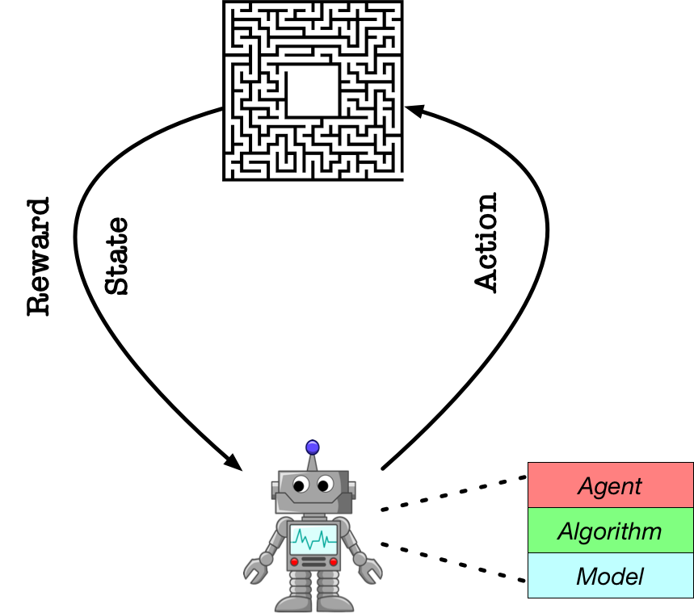

<!--
 * @Author: jianzhnie
 * @LastEditors: jianzhnie
 * @Description: RLToolKit is a flexible and high-efficient reinforcement learning framework.
 * Copyright (c) 2022 by jianzhnie@126.com, All Rights Reserved.
-->

# RLToolkit

- [RLToolkit](#rltoolkit)
  - [Abstractions](#abstractions)
    - [Model](#model)
    - [Algorithm](#algorithm)
    - [Agent](#agent)
  - [Contents](#contents)
    - [Policy Gradient Series](#policy-gradient-series)
    - [DQN Series](#dqn-series)
    - [Supported Envs:](#supported-envs)
  - [Examples](#examples)
  - [Experimental Demos](#experimental-demos)
  - [Contributions](#contributions)
  - [Citation:](#citation)

RLToolkit is a flexible and high-efficient reinforcement learning framework. RLToolkit ([website](https://github.com/jianzhnie/deep-rl-toolkit))) is developed for practitioners with the following advantages:

- **Reproducible**. We provide algorithms that stably reproduce the result of many influential reinforcement learning algorithms.

- **Extensible**. Build new algorithms quickly by inheriting the abstract class in the framework.

- **Reusable**.  Algorithms provided in the repository could be directly adapted to a new task by defining a forward network and training mechanism will be built automatically.

- **Elastic**: allows to elastically and automatically allocate computing resources on the cloud.

- **Lightweight**: the core codes <1,000 lines (check [Demo]()).

- **Stable**: much more stable than [Stable Baselines 3](https://github.com/DLR-RM/stable-baselines3) by utilizing various ensemble methods.


## Abstractions

<p align="center">

</p>

RLToolkit aims to build an agent for training algorithms to perform complex tasks.
The main abstractions introduced by PARL that are used to build an agent recursively are the following:

### Model
`Model` is abstracted to construct the forward network which defines a policy network or critic network given state as input.

### Algorithm
`Algorithm` describes the mechanism to update parameters in `Model` and often contains at least one model.

### Agent
`Agent`, a data bridge between the environment and the algorithm, is responsible for data I/O with the outside environment and describes data preprocessing before feeding data into the training process.


## Contents
RLToolkit implements the following model-free deep reinforcement learning (DRL) algorithms:

- **DDPG, TD3, SAC, PPO, REDQ** for continuous actions in single-agent environment,
- **DQN, Double DQN, D3QN, SAC** for discrete actions in single-agent environment,
- **QMIX, VDN, MADDPG, MAPPO, MATD3** in multi-agent environment.

### Policy Gradient Series
1. Advantage Actor-Critic (A2C)
2. Proximal Policy Optimization Algorithms (PPO)
3. Deep Deterministic Policy Gradient (DDPG)
4. Twin Delayed Deep Deterministic Policy Gradient Algorithm (TD3)
5. Soft Actor-Critic (SAC)
6. DDPG from Demonstration (DDPGfD)
7. Behavior Cloning (with DDPG)

### DQN Series
1.  DQN
2.  DoubleDQN
3.  PrioritizedExperienceReplay
4.  DuelingNet
5.  NoisyNet
6.  CategoricalDQN
7.  N-stepLearning
8.  Rainbow

###  Supported Envs:

- **OpenAI Gym**
- **Atari**
- **MuJoCo**
- **PyBullet**

For the details of DRL algorithms, please check out the educational webpage [OpenAI Spinning Up](https://spinningup.openai.com/en/latest/).


## Examples
- [QuickStart](./benchmark/quickstart/train.py)
- [DQN](./benchmark/dqn/train.py)
- [DDPG](./benchmark/ddpg/train.py)
- [A2C](./benchmark/a2c/train.py)
- [TD3](./benchmark/td3/train.py)
- [SAC](./benchmark/sac/train.py)
- [QMIX](./benchmark/qmix/train.py)
- [MADDPG](./benchmark/maddpg/train.py)
- [PPO](./benchmark/ppo/train.py)


## Experimental Demos

```python
# into demo dirs
cd  benchmark/quickstart/

# train
python train.py
```

## Contributions

We welcome any contributions to the codebase, but we ask that you please **do not** submit/push code that breaks the tests. Also, please shy away from modifying the tests just to get your proposed changes to pass them. As it stands, the tests on their own are quite minimal (instantiating environments, training agents for one step, etc.), so if they're breaking, it's almost certainly a problem with your code and not with the tests.

We're actively working on refactoring and trying to make the codebase cleaner and more performant as a whole. If you'd like to help us clean up some code, we'd strongly encourage you to also watch [Uncle Bob's clean coding lessons](https://www.youtube.com/playlist?list=PLmmYSbUCWJ4x1GO839azG_BBw8rkh-zOj) if you haven't already.


## Citation:

To cite this repository:

```
@misc{erl,
  author = {jianzhnie},
  title = {{RLToolkit}: An Easy  Deep Reinforcement Learning Toolkit},
  year = {2022},
  publisher = {GitHub},
  journal = {GitHub repository},
  howpublished = {\url{https://github.com/jianzhnie/deep-rl-toolkit}},
}
```
