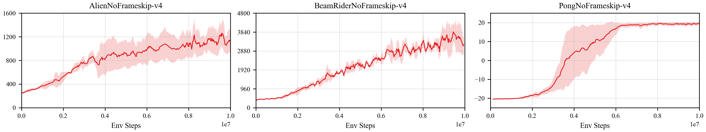
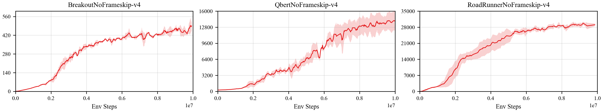

<!--
 * @Author: jianzhnie
 * @Date: 2022-09-02 14:55:20
 * @LastEditors: jianzhnie
 * @LastEditTime: 2022-09-03 11:11:31
 * @Description:
 * Copyright (c) 2022 by jianzhnie@126.com, All Rights Reserved.
-->
## Reproduce A2C with Pytorch
Based on Pytorch, the A2C algorithm of deep reinforcement learning has been reproduced, reaching the same level of indicators as the paper in Atari benchmarks.

### Atari game introduction
Please see [here](https://gym.openai.com/envs/#atari) to know more about Atari games.

### Benchmark result
Mean episode reward of A2C on some atari games in training process after 10 million sample steps.

<p align="center">

</p>
<p align="center">

</p>


## How to use
### Dependencies
+ gym==0.18.0
+ atari-py==0.2.6
+ torch==1.7.1


### Training

```bash
python train.py
```

### Reference

+ [Ray](https://github.com/ray-project/ray)
+ [OpenAI Baselines: ACKTR & A2C](https://openai.com/blog/baselines-acktr-a2c/)
