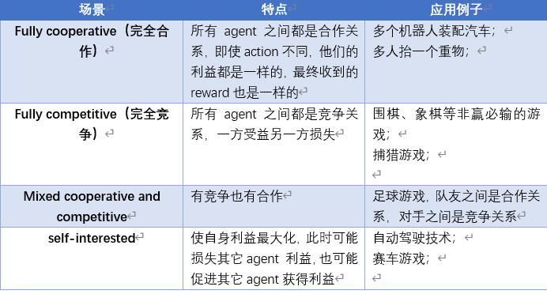
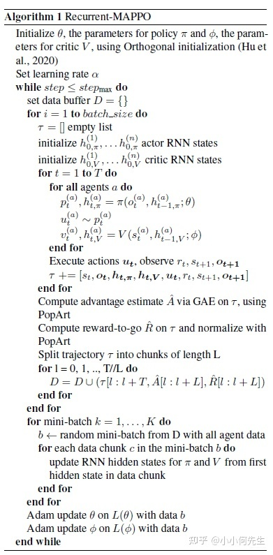

# MAPPO

MAPPO是一种多代理最近策略优化深度强化学习算法，它是一种on-policy算法，采用的是经典的actor-critic架构，其最终目的是寻找一种最优策略，用于生成agent的最优动作。

## 场景设定

一般来说，多智能体强化学习有四种场景设定：



通过调整MAPPO算法可以实现不同场景的应用，但就此篇论文来说，其将MAPPO算法用于Fully cooperative场景中，在本文中所有Agent共享奖励（共用一个奖励函数)，即所有智能体的奖励由一套公式生成。

## 通信架构

现有的多 agent 深度强化学习算法通信方式主要由三种：

- 全通信集中决策：联合感知，中心决策（神经网络内部通信）
- 全通信自主决策：联合感知，独立决策（神经网络之前通信）
- 欠通信自主决策：无信息交互，独立决策（一般用循环神经网络）

不同的算法框架决定了不同的通信方式，MAPPO有中心式、分散式和混合式三种框架。


我们在应用MAPPO算法时，应该先明确算法框架，用的最多是混合式的框架，即中心化训练、去中心化执行的框架，刚开始时智能体将自己的状态观测数据传递给中心控制器，中央控制器得到全局状态S后对模型进行训练，得到最优分散控制策略后传给agent，训练完后智能体就可以不再与中心控制器通信，可以基于自己的局部观测状态通过自己的动作策略函数来产生最优动作。


值得注意的是，在这种框架中每个智能体有单独的actor-critic网络，训练时智能体自己的actor网络要接受每个critic的打分。


多智能体强化学习算法大致上可以分为两类，**[中心式](<>)** 和 **分散式**。**中心式**的思想是考虑一个合作式的环境，直接将单智能体算法扩展，让其直接学习一个联合动作的输出，但是并不好给出单个智能体该如何进行决策。**分散式**是每个智能体独立学习自己的奖励函数，对于每个智能体来说，其它智能体就是环境的一部分，因此往往需要去考虑环境的非平稳态。并且分散式学习到的并不是全局的策略。

最近的一些工作提出了两种框架连接中心式和分散式这两种极端方法，从而得到折衷的办法：**中心式训练分散式执行**(`centealized training and decentralized execution CTDE`)和 **值分解** (`value decomposition VD`)。

`CETD`的方式通过学习一个全局的`Critic`来减少值函数的方差，这类方法的代表作有`MADDPG`和`COMA`；`VD`通过对局部智能体的`Q`函数进行组合来得到一个联合的`Q`函数。

`MAPPO`采用一种中心式的值函数方式来考虑全局信息，属于`CTDE`框架范畴内的一种方法，通过一个全局的值函数来使得各个单个的`PPO`智能体相互配合。它有一个前身`IPPO`，是一个完全分散式的`PPO`算法，类似`IQL`算法。

`MAPPO`中每个智能体i基于局部观测$$o_{i}$$和一个共享策略(这里的共享策略是针对智能体是同类型的情况而言的，对于非同类型的，可以拥有自己独立的`actor`和`critic`网络)  $$\pi_{\theta}(a_{i}|o_{i}$$)去生成一个动作$$a_{i}$$来最大化折扣累积奖励：$J(\theta)=\mathbb{E}_{a^{t}, s^{t}}\left[\sum_{t} \gamma^{t} R\left(s^{t}, a^{t}\right)\right]$$。基于全局的状态s来学习一个中心式的值函数$$V_{\phi}(s)$$。

MAPPO的思路和MADDPG是一样的，都是基于`decentralized actor centralized critc`的方式，同样是critic可以使用全局的状态信息，而actor只使用局部的状态信息。不同的是PPO是一个on policy 算法，之前的multi-agent  policy gradient的算法一般都是基于off policy的算法，但是MAPPO经过简单的超参数调整就能获得比较好的成绩。

## MAPPO算法推导

对于多智能体任务，我们的目标是确定最优分散策略π来最大化折扣回报η(π)，它等于状态价值函数的期望值。


那么找到最优分散策略（也即每个智能体的策略函数)使回报最大，成为模型训练的最终目的。

### 参数更新

跟单智能体通过迭代训练更新网络参数一样，MAPPO算法也是用一些策略梯度算法（不同文章可能采用不同的策略梯度）来更新神经网络参数ω、θ，因此训练的核心就成为了更新参数ω、θ。


## **MAPPO伪代码**

`MAPPO`算法的伪代码如下所示：



也就是说有两个网络，策略$\pi_{\theta}$和值函数 $V_{\phi}$$ 值函数$$V_{\phi}$$需要学习一个映射：$$S \rightarrow \mathbb{R}$$。策略函数$$\pi_{\theta}$$学习一个映射从观测$$o_{t}^{(a)}$到一个范围的分布或者是映射到一个[高斯函数]()的动作均值和方差用于之后采样动作。

##

> 作者在文献附录中有谈到说如果智能体是同种类的就采用相同的网络参数，对于每个智能体内部也可以采用各自的`actor`和`critic`网络，但是作者为了符号的便利性，直接就用的一个网络参数来表示。

- `Actor`网络优化目标为：

$$
\begin{array}{l} L(\theta) = {\left[\frac{1}{B n} \sum_{i=1}^{B} \sum_{k=1}^{n} \min \left(r_{\theta, i}^{(k)} A_{i}^{(k)}, \operatorname{clip}\left(r_{\theta, i}^{(k)}, 1-\epsilon, 1+\epsilon\right) A_{i}^{(k)}\right)\right]} \\ \left.+\sigma \frac{1}{B n} \sum_{i=1}^{B} \sum_{k=1}^{n} S\left[\pi_{\theta}\left(o_{i}^{(k)}\right)\right)\right], \text { where } r_{\theta, i}^{(k)}=\frac{\pi_{\theta}\left(a_{i}^{(k)} \mid o_{i}^{(k)}\right)}{\pi_{\theta_{\text {old }}}\left(a_{i}^{(k)} \mid o_{i}^{(k)}\right)} . \end{array}
$$

  其中优势函数$$A_{i}^{(k)}$$是采用`GAE`方法的，S 表示策略的熵，$$\sigma$$ 是控制熵系数的一个超参数。

- `Critic`网络优化目标为：

$$
\begin{array}{l} L(\phi)=\frac{1}{B n} \sum_{i=1}^{B} \sum_{k=1}^{n}\left(\operatorname { m a x } \left[\left(V_{\phi}\left(s_{i}^{(k)}\right)-\right.\right.\right.\left.\hat{R}_{i}\right)^{2}, \\  \left(\operatorname{clip}\left(V_{\phi}\left(s_{i}^{(k)}\right), V_{\phi_{\text {old }}}\left(s_{i}^{(k)}\right)-\varepsilon, V_{\phi_{\text {old }}}\left(s_{i}^{(k)}\right)+\varepsilon\right)-\right.\left.\left.\hat{R}_{i}\right)^{2}\right] \end{array}
$$

  其中$$\hat{R}_{i}$$是折扣奖励。B 表示`batch_size`的大小，$n$ 表示智能体的数量。

基本流程是：

1. 初始化Q和π，神经网络参数ω、θ为超参数（ω、θ开始时随机初始化，通过训练来改进ω、θ）
2.  初试化relay buffer D
3. 在一个定义步长内，arent u执行策略函数π(old)产生的动作，得到reward r(t)和下一个状态s(t+1)
4.  通过计算得到矩形框内数据
5. 储存数据到buffer D中去
6. 打乱D中的数据顺序，并从新编号（从而打破数据之间的相关性，从而稳定训练过程）
7. 抽取数据并更新ω、θ，然后用更新后的参数去更新Q和π。


## **PPO实战技巧**

对于单个智能体来说，`PPO`中实战的技巧也都有采用过来：

1. `Generalized Advantage Estimation`：这个技巧来自文献：Hign-dimensional continuous control using generalized advantage estimation。
2. `Input Normalization`
3. `Value Clipping`：与策略截断类似，将值函数进行一个截断。
4. `Relu activation with Orthogonal Initialization`：
5. `Gredient Clipping`：梯度更新不要太大。
6. `Layer Normalization`：这个技巧来自文献：Regularization matters in policy optimization-an empirical study on continuous control。
7. `Soft Trust-Region Penalty`：这个技巧来自文件：Revisiting design choices in proximal policy optimization。


## **MAPPO实战技巧**

value normalization, value function inputs, training data usage, policy/value clipping, and batch size

### Value Normalization

`PopArt`这个算法本来是用来处理多任务强化学习算法中，不同任务之间的奖励不一样的这样一个问题，将不同任务的奖励进行归一化处理， 只需要训练一个智能体就可以同时解决多种任务。例如，在[吃豆人](https://www.zhihu.com/search?q=%E5%90%83%E8%B1%86%E4%BA%BA&search_source=Entity&hybrid_search_source=Entity&hybrid_search_extra=%7B%22sourceType%22%3A%22article%22%2C%22sourceId%22%3A%22386559032%22%7D)(`Ms. Pac-Man`)游戏中，智能体的目标是收集小球，收集一颗奖励`10` 分，而吃掉幽灵则奖励`200`到`1600`分，这样智能体对于不同任务就会有偏重喜好。

为了稳定价值函数`Value`学习，本文借鉴了PopArt技术并且通过使用价值目标的平均值和标准差的运行估计来标准化价值函数的目标。 具体来说，就是在价值学习过程中，让价值网络回归到归一化的目标值函数。

当计算GAE时，将用这个running average 对价值网络的输出进行反归一化，以便正确缩放价值输出。 发现使用值归一化不会损害训练，并且通常会显着提高 MAPPO 的最终性能。

这个技巧来自文献：`Multi-task Deep Reinforcement Learning with popart`。

### **Agent-Specific Global State**

对于多智能体算法而言，大部分的工作都在处理值函数这一块，因为大部分算法都是通过值函数来实现各个子智能体的相互配合。普遍认为，对于centralized value functions来说，观察到full global state 使一个部分可观测马尔可夫决策问题(`POMDP`)转化为了一个马尔可夫决策问题(`MDP`)。因此价值学习也会更加容易，而一个正确的value function也会提升policy learning。

`Multi-agent actor-critic for mixed cooperative-competitive environment`中提出将所有智能体地局部观测信息拼接起来$$\left(o_{1}, \ldots, o_{n}\right)$$作为`Critic`的输入，存在的问题就是智能体数量太多之后，尤其是值函数的输入维度远高于策略函数的输入维度的时候，会使得值函数的学习变得更加困难。还有一种方法是用环境直接提供的全局信息，然而有的global state可能包含的信息比local obs更少，这个会使得价值学习更加困难。

`SMAC`环境有提供一个包含所有智能体和敌方的全局信息，但是这个信息并不完整。虽然每个智能体的局部信息中会缺失敌方的信息，但是会有一些智能体特有的信息，像智能体的`ID`、可选动作、相对距离等等，这些在全局状态信息中是没有的。因此作者构建了一个带有智能体特征的全局状态信息，包含所有的全局信息和一些必须的局部智能体特有的状态特征。

采用 agent-specific 的全局信息，直接使用各个智能体observation联合起来可能会导致维度过高，而使用state又可能导致丢失信息。所以在学习每个agent的critic时，除了使用全局信息之外，还用到了一些agent相关的特征，比如agent id、当前agent可行的动作等。

IPPO算法说明了将PPO应用到多智能体系统中是十分有效的。本文则更进一步，将IPPO算法扩展为MAPPO。区别是PPO的critic部分使用全局状态state而不是observation作为输入。

### **Training Data Usage**

防止同一份数据训练次数过多。简单任务中推荐使用 15 training epochs，而对于较难的任务，尝试 10 或者 5 training epochs。除此之外，尽量使用一整份的训练数据，而不要切成很多小份的mini-batch训练。

### PPO Clipping

PPO 的另一个核心特性是使用裁剪的重要性比率和价值损失来防止策略和价值函数在迭代之间发生剧烈变化。 裁剪强度由超参数 $epslion$ 控制：较大的 $epslion$  值允许对策略和值函数进行较大的更新。 与训练 epoch 的数量类似，我们假设策略和值裁剪可以控制训练期间所有Agent的策略变化引起的非平稳性。 对于小的 $epslion$ ，智能体的策略每次更新的变化可能会更少，我们认为这会提高整体学习稳定性，但可能会牺牲学习速度。 在单Agent设置中，常见值为 0.2。

### PPO Batch Size

在训练更新期间，PPO 对一组策略上的轨迹进行采样，这些轨迹用于估计策略和价值函数目标的梯度。 由于我们的训练中mini-batches的数量是固定的（参见第 5.3 节），更大的批量通常会导致更准确的梯度，从而更好地更新价值函数和策略。 但是，批次的累积受到可用计算量和内存量的限制：收集大量轨迹需要广泛的并行性以提高效率，batch 需要存储在 GPU 内存中。因此，就所需的计算和样本效率而言，大批量可能会造成浪费。

### **Action Masking**

由于游戏规则的限制, 多智能体任务中经常出现 agent 无法执行某些 action 的情况。当计算动作概率$$\pi_{\theta}\left(a_{i} \mid o_{i}\right)$$的时候，我们将不被允许的动作直接`mask`掉，这样在前向和反向传播的过程中，这些动作将永远为`0`，作者发现这种做法能够加速训练。

### **Death Masking**

 在多智能体任务中，也经常会出现agent死亡的情况。当 agent 死亡后，在`Agent-Specific`特征中直接用一个`0`向量来描述即可， 后续的状态输入只保留其 agent id，其他信息全部置为0。

## **代码解析**

- `MAPPO`官方代码链接：`https://github.com/marlbenchmark/on-policy`。

### **总体理解**

每个局部智能体接收一个局部的观察`obs`，输出一个动作概率，所有的`actor`智能体都采用一个`actor`网络。`critic`网络接收所有智能体的观测`obs`，$$cent\_obs\_space= n \times obs\_space$$ 其中 n 为智能体的个数，输出为一个 V 值，这个V值用于`actor`的更新。`actor`的`loss`和`PPO`的`loss`类似，有添加一个熵的`loss`。`Critic`的`loss`更多的是对`value`的值做`normalizer`，并且在计算`episode`的折扣奖励的时候不是单纯的算折扣奖励，有采用`gae`算折扣回报的方式。

#### 网络定义

代码定义在`onpolicy/algorithms/r_mappo/algorithm/rMAPPOPolicy.py`

每一个智能体的观测`obs_space`为一个`14`维的向量，有两个智能体，`cent_obs_space`为一个`28`纬的向量，单个智能体的动作空间`act_space`为一个离散的`5`个维度的向量。

- **actor**

  输入一个观测，`14`维度，输出一个确切的动作`actions`和这个动作对数概率，这部分代码在`onpolicy/algorithms/utils/act.py`中。

```python3
action_dim = action_space.n
self.action_out = Categorical(inputs_dim, action_dim, use_orthogonal, gain)
action_logits = self.action_out(x, available_actions)
actions = action_logits.mode() if deterministic else action_logits.sample()
action_log_probs = action_logits.log_probs(actions)
```

- **critic**

`critic`输入维度为cent_obs_space= n * obs_space = 28。输出是一个特征值向量，也就是输出纬度为`1`。

#### **采样流程**

- **初始化初始的观测**

```python
def make_train_env(all_args):
    def get_env_fn(rank):
        def init_env():
            if all_args.env_name == "StarCraft2":
                env = StarCraft2Env(all_args)
            else:
                print("Can not support the " + all_args.env_name + "environment.")
                raise NotImplementedError
            env.seed(all_args.seed + rank * 1000)
            return env

        return init_env

    if all_args.n_rollout_threads == 1:
        return ShareDummyVecEnv([get_env_fn(0)])
    else:
        return ShareSubprocVecEnv([get_env_fn(i) for i in range(all_args.n_rollout_threads)])
```

根据参数实例化多个环境：  all_args.n_rollout_threads， 一般为32

如果采用`centralized_V`值函数的训练方式，则需要初始化的时候构造出多个智能体的`share_obs`：

```python
obs = self.envs.reset()  # shape = (5, 2, 14)
share_obs = obs.reshape(self.n_rollout_threads, -1)  # shape = (5, 28)
# 指定两个智能体
share_obs = np.expand_dims(share_obs, 1).repeat(self.num_agents, axis=1) # shape = (5, 2, 28)
```

`share_obs`中会将 n=2 个智能体的`obs`叠加在一起作为`share_obs`。

- **collect() 采用rollout方式采样数据**

  调用`self.trainer.prep_rollout()`函数将`actor`和`critic`都设置为`eval()`格式。然后用`np.concatenate()`函数将并行的环境的数据拼接在一起，这一步是将并行采样的那个纬度降掉：

代码在 `on-policy/onpolicy/algorithms/r_mappo/r_mappo.py`

```python
def prep_rollout(self):
  self.policy.actor.eval()
  self.policy.critic.eval()
```

代码在 `on-policy/onpolicy/runner/shared/smac_runner.py`

```python
@torch.no_grad()
def collect(self, step):
  self.trainer.prep_rollout()
  value, action, action_log_prob, rnn_state, rnn_state_critic \
  = self.trainer.policy.get_actions(np.concatenate(self.buffer.share_obs[step]),
                                    np.concatenate(self.buffer.obs[step]),
                                    np.concatenate(self.buffer.rnn_states[step]),
                                    np.concatenate(self.buffer.rnn_states_critic[step]),
                                    np.concatenate(self.buffer.masks[step]),
                                    np.concatenate(self.buffer.available_actions[step]))
  # [self.envs, agents, dim]
  values = np.array(np.split(_t2n(value), self.n_rollout_threads))
  actions = np.array(np.split(_t2n(action), self.n_rollout_threads))
  action_log_probs = np.array(np.split(_t2n(action_log_prob), self.n_rollout_threads))
  rnn_states = np.array(np.split(_t2n(rnn_state), self.n_rollout_threads))
  rnn_states_critic = np.array(np.split(_t2n(rnn_state_critic), self.n_rollout_threads))

  return values, actions, action_log_probs, rnn_states, rnn_states_critic
```

上面的代码就是将数据传入总的`MAPPO`策略网络`R_MAPPOPolicy`(`onpolicy/algorithms/r_mappo/algorithm/rMAPPOPolicy.py`)中去获取一个时间步的数据。在`get_actions()`函数里面会调用`actor`去获取动作和动作的对数概率，`critic`网络去获取对于`cent_obs`的状态值函数的输出：

```python
def get_actions(self, cent_obs, obs, rnn_states_actor, rnn_states_critic, masks, available_actions=None,
                deterministic=False):
  """
        Compute actions and value function predictions for the given inputs.
        :param cent_obs (np.ndarray): centralized input to the critic.
        :param obs (np.ndarray): local agent inputs to the actor.
        :param rnn_states_actor: (np.ndarray) if actor is RNN, RNN states for actor.
        :param rnn_states_critic: (np.ndarray) if critic is RNN, RNN states for critic.
        :param masks: (np.ndarray) denotes points at which RNN states should be reset.
        :param available_actions: (np.ndarray) denotes which actions are available to agent
                                  (if None, all actions available)
        :param deterministic: (bool) whether the action should be mode of distribution or should be sampled.

        :return values: (torch.Tensor) value function predictions.
        :return actions: (torch.Tensor) actions to take.
        :return action_log_probs: (torch.Tensor) log probabilities of chosen actions.
        :return rnn_states_actor: (torch.Tensor) updated actor network RNN states.
        :return rnn_states_critic: (torch.Tensor) updated critic network RNN states.
        """
  actions, action_log_probs, rnn_states_actor = self.actor(obs,
                                                           rnn_states_actor,
                                                           masks,
                                                           available_actions,
                                                           deterministic)

  values, rnn_states_critic = self.critic(cent_obs, rnn_states_critic, masks)
  return values, actions, action_log_probs, rnn_states_actor, rnn_states_critic
```

`obs`这里的`shape`是(`5*2, 14`)，输出`actions`的`shape`, 和`action_log_probs`的`shape`都为(`10 , 1`)。

```python
def get_values(self, cent_obs, rnn_states_critic, masks):
  """
        Get value function predictions.
        :param cent_obs (np.ndarray): centralized input to the critic.
        :param rnn_states_critic: (np.ndarray) if critic is RNN, RNN states for critic.
        :param masks: (np.ndarray) denotes points at which RNN states should be reset.

        :return values: (torch.Tensor) value function predictions.
        """
  values, rnn_states_critic = self.critic(cent_obs, rnn_states_critic, masks)
  return values
```

`cent_obs`的`shape`是(`5*2, 28`)，输出是`shape=(10, 1)`。

最后将(`10 , 1`)的`actions`转换成(`5, 2, 1`)的形式，方便之后并行送到并行的环境中去，作者这里还将动作进行了`one-hot`编码，最后变成了(`5, 2, 5`)的形式送入到环境中去。代码在 `smac_runner`(`on-policy/onpolicy/runner/shared/smac_runner.py`).

```python
obs, rewards, dones, infos = self.envs.step(actions_env)
data = obs, rewards, dones, infos, values, actions, action_log_probs, rnn_states, rnn_states_critic
# insert data into buffer
self.insert(data)
```

环境下一次输出的`obs`还是(`5, 2, 14`)的形式，  之后调`insert`方法将数据添加到`buffer`里面，在`insert`方法里面会将局部观测构造一个全局观测`share_obs`其shape=(`5, 2, 28`)出来：代码在 `smac_runner`(`on-policy/onpolicy/runner/shared/smac_runner.py`).

```python
def insert(self, data):
    obs, rewards, dones, infos, values, actions, action_log_probs, rnn_states, rnn_states_critic = data

    rnn_states[dones == True] = np.zeros(((dones == True).sum(), self.recurrent_N, self.hidden_size), dtype=np.float32)
    rnn_states_critic[dones == True] = np.zeros(((dones == True).sum(), *self.buffer.rnn_states_critic.shape[3:]), dtype=np.float32)
    masks = np.ones((self.n_rollout_threads, self.num_agents, 1), dtype=np.float32)
    masks[dones == True] = np.zeros(((dones == True).sum(), 1), dtype=np.float32)

    if self.use_centralized_V:
        share_obs = obs.reshape(self.n_rollout_threads, -1)
        share_obs = np.expand_dims(share_obs, 1).repeat(self.num_agents, axis=1)
    else:
        share_obs = obs

    self.buffer.insert(share_obs, obs, rnn_states, rnn_states_critic, actions, action_log_probs, values, rewards, masks)
```

上述过程循环迭代`self.episode_length=200`次。

### **训练流程**

#### **计算优势函数**

训练开始之前，首先调用`self.compute()`函数计算这个`episode`的折扣回报，在计算折扣回报之前，先算这个`episode`最后一个状态的状态值函数`next_values`，其`shape=(10, 1)`然后调用`compute_returns`函数计算折扣回报：

代码在 `smac_runner`(`on-policy/onpolicy/runner/shared/smac_runner.py`).

```python
def compute(self):
    """Calculate returns for the collected data."""
    self.trainer.prep_rollout()
    next_values = self.trainer.policy.get_values(np.concatenate(self.buffer.share_obs[-1]),
                                            np.concatenate(self.buffer.rnn_states_critic[-1]),
                                            np.concatenate(self.buffer.masks[-1]))
    next_values = np.array(np.split(_t2n(next_values), self.n_rollout_threads))
    self.buffer.compute_returns(next_values, self.trainer.value_normalizer)
```

有了数据之后就可以开始计算折扣回报了 (这里有采用`gae`算折扣回报的方式，并且有将`value`做`normalizer`)。`compute_returns`函数在`onpolicy/utils/shared_buffer.py`文件中，核心代码如下：

```python
self.value_preds[-1] = next_value
for step in reversed(range(self.rewards.shape[0])):
 delta = self.rewards[step] + self.gamma * value_normalizer.denormalize(
                            self.value_preds[step + 1]) * self.masks[step + 1] \
                                - value_normalizer.denormalize(self.value_preds[step])
    gae = delta + self.gamma * self.gae_lambda * self.masks[step + 1] * gae
    self.returns[step] = gae + value_normalizer.denormalize(self.value_preds[step])
```

算完折扣回报之后调用`self.train()`函数进行训练：

```python
def train(self):
    """Train policies with data in buffer. """
    self.trainer.prep_training()  # 将网络设置为train()的格式。
    train_infos = self.trainer.train(self.buffer)
    self.buffer.after_update()  # 将buffer的第一个元素设置为其episode的最后一个元素
    return train_infos
```

在`self.trainer.train(self.buffer)`函数中先基于数据，计算优势函数(优势函数是针对全局的观测信息所得到的)：

```python
advantages = buffer.returns[:-1] - self.value_normalizer.denormalize(buffer.value_preds[:-1])
advantages_copy = advantages.copy()
advantages_copy[buffer.active_masks[:-1] == 0.0] = np.nan
mean_advantages = np.nanmean(advantages_copy) # float, shape = (1)
std_advantages = np.nanstd(advantages_copy)  # float, shape = (1)
advantages = (advantages - mean_advantages) / (std_advantages + 1e-5)
```

然后从`buffer`中采样数据，把线程、智能体的纬度全部降掉(`onpolicy/algorithms/r_mappo/r_mappo.py`)：

```python
share_obs_batch, obs_batch, rnn_states_batch, rnn_states_critic_batch, actions_batch, \
        value_preds_batch, return_batch, masks_batch, active_masks_batch, old_action_log_probs_batch, \
        adv_targ, available_actions_batch = sample
```

拿到采样之后的数据，把`obs`送给`actor`网络，得到`action_log_probs`, `dist_entropy`。把`cent_obs`送到`critic`得到新的`values`。

#### **计算actor的loss**

有了新老动作的概率分布和优势函数之后就可以更新`actor`网络了：

```python
# actor update
imp_weights = torch.exp(action_log_probs - old_action_log_probs_batch)

surr1 = imp_weights * adv_targ
surr2 = torch.clamp(imp_weights, 1.0 - self.clip_param, 1.0 + self.clip_param) * adv_targ
policy_action_loss = (-torch.sum(torch.min(surr1, surr2),
                                             dim=-1,
                                             keepdim=True) * active_masks_batch).sum() / active_masks_batch.sum()
(policy_loss - dist_entropy * self.entropy_coef).backward()
```

#### **计算critic的loss**

新的`value`和老的`value_preds_batch`和计算的`return_batch`送到`onpolicy/algorithms/r_mappo/r_mappo.py`文件的`cal_value_loss`函数中去计算`critic`的`loss`：

```python
value_loss = self.cal_value_loss(values, value_preds_batch, return_batch, active_masks_batch)
```

先对`value`做一个`clipped`：

```python
value_pred_clipped = value_preds_batch + (values - value_preds_batch).clamp(-self.clip_param, self.clip_param)
```

然后计算误差的`clip`：

```python
error_clipped = return_batch - value_pred_clipped
error_original = return_batch - values
```

有了误差直接就可以计算`loss`：

```py
value_loss_clipped = mse_loss(error_clipped)
value_loss_original = mse_loss(error_original)
```

算出`loss`之后反向传播即可：

```python
(value_loss * self.value_loss_coef).backward()
```

## Reference

- The Surprising Effectiveness of MAPPO in Cooperative, Multi-Agent Games [paper]( https://arxiv.org/abs/2103.01955>)   [code](<https://github.com/marlbenchmark/on-policy>)
