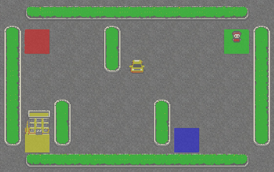
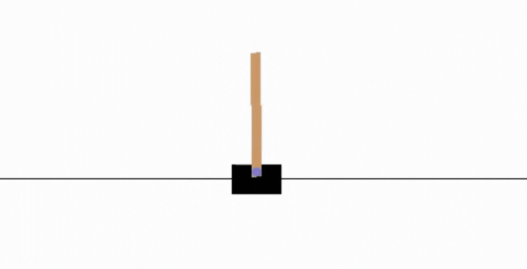
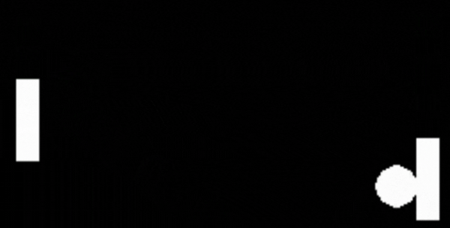

# 《强化学习入门实践》课程

针对强化学习初学者，提供了入门课程，展示最基础的5个强化学习算法代码示例。

## 在这个课程中，您将收获：

- 📖 在理论和实践中学习深度强化学习。
- 🧑‍💻 学习使用Pytorch 从0到1开发一个智能体
- 🤖 在不同环境中训练智能体，例如Cartpole， Pong 等经典环境。
- 💾 将你训练有素的智能体模型发布到 Hub, 并分享您的代码。
- 🏆 参加智能体任务挑战，您将在公开任务上评估您的智能体并和与其他团队进行比较。
- 🖌️🎨 学习分享您的经验，制作的您自己的环境。


## 课程大纲

+ 一、强化学习(RL)初印象
    + RL概述、入门路线
    + 实践：
      + 环境搭建1（[lesson1](lesson1/gridworld.py) 的代码提供了格子环境世界的渲染封装）
      + 环境搭建2（[lesson1](lesson1/gym_example.py) 的代码提供了CartPole 的环境例子）
+ 二、基于表格型方法求解RL
    + MDP、状态价值、Q表格
    + 实践：
      + [Sarsa](lesson2/sarsa/train.py)
      + [Q-learning](lesson2/q_learning/train.py)
+ 三、基于神经网络方法求解RL
    + 函数逼近方法
    + 实践：
      + [DQN](lesson3/DQN/train.py)
      + [Double DQN](lesson3/DQN/train.py)
      + [N-step DQN](lesson3/N-step-DQN/train.py)
      + [Noisy DQN](lesson3/Noisy-DQN/train.py)
      + [Rainbow ](lesson3/Rainbow/train.py)
+ 四、基于策略梯度求解RL
    + 策略近似、策略梯度
    + 实践：
      + [Policy Gradient](lesson4/policy_gradient)
      + [TRPO](lesson4/policy_gradient)
      + [PPO](lesson4/policy_gradient)
+ 五、连续动作空间上求解RL
    + 实战：[DDPG](lesson5/ddpg)

## The Syllabus 🏗️

This course is **self-paced** you can start when you want 🥳.

| 📆 Publishing date                                            | 📘 Unit                                             | 👩‍💻 Hands-on |
| ------------------------------------------------------------ | -------------------------------------------------- | ----------- |
| [Published 🥳]() | [An Introduction to Deep Reinforcement Learning]() | []()        |
|                                                              |                                                    |             |

### Gym classic and controls environments 🕹️

| Environment     | Screenshot                                       |
| --------------- | ------------------------------------------------ |
| Lunar Lander 🚀🌙 |  |
| Frozen Lake ⛄   |    |
| Taxi 🚖          |                |
| Cartpole        |        |
| Pong 🎾          |                |
| Pixelcopter 🚁   |         |


## 代码使用说明

### 安装依赖（注意：请务必安装对应的版本）

+ Python 3.7
+ gym==0.18.0
+ torch 1.5+

可以直接安装本目录下的 `requirements.txt` 来完成以上依赖版本的适配。

```
pip install -r requirements.txt
```

### 运行示例

进入每个示例对应的代码文件夹中，运行
```
python train.py
```

## Prerequisites
- Good skills in Python 🐍
- Basics in Deep Learning and Pytorch

If it's not the case yet, you can check these free resources:
- Python: https://www.udacity.com/course/introduction-to-python--ud1110
- Intro to Deep Learning with PyTorch: https://www.udacity.com/course/deep-learning-pytorch--ud188
- PyTorch in 60min: https://pytorch.org/tutorials/beginner/deep_learning_60min_blitz.html


## Citing the project

To cite this repository in publications:

```bibtex
@misc{deep reinformentlearing course,
  author = {JianZheng},
  title = {Deep reinformentlearing course },
  year = {2022},
  publisher = {GitHub},
  journal = {GitHub repository},
  howpublished = {\url{https://github.com/jianzhnie/deep-rl-toolkit}},
```
